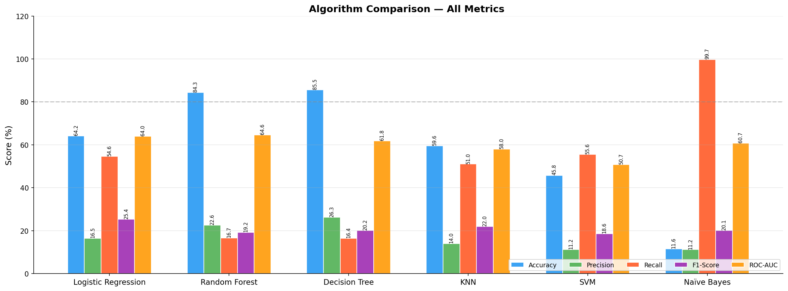
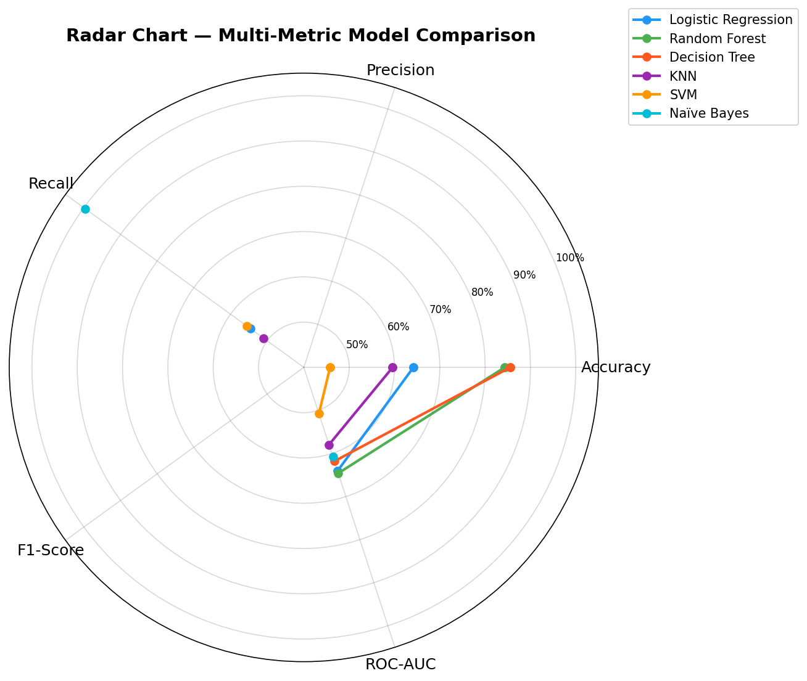
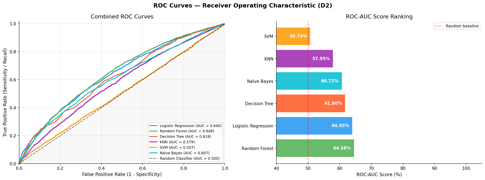
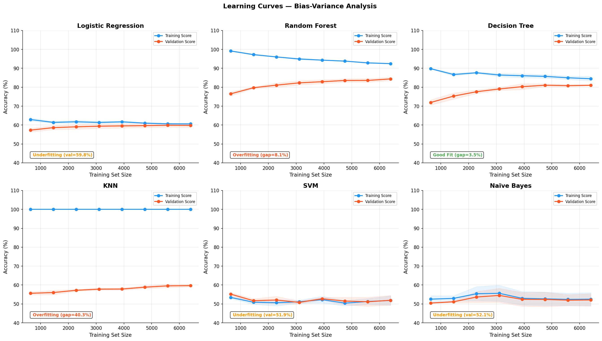
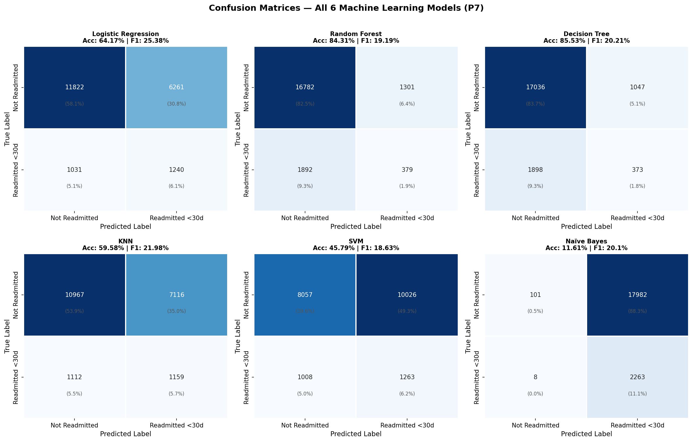
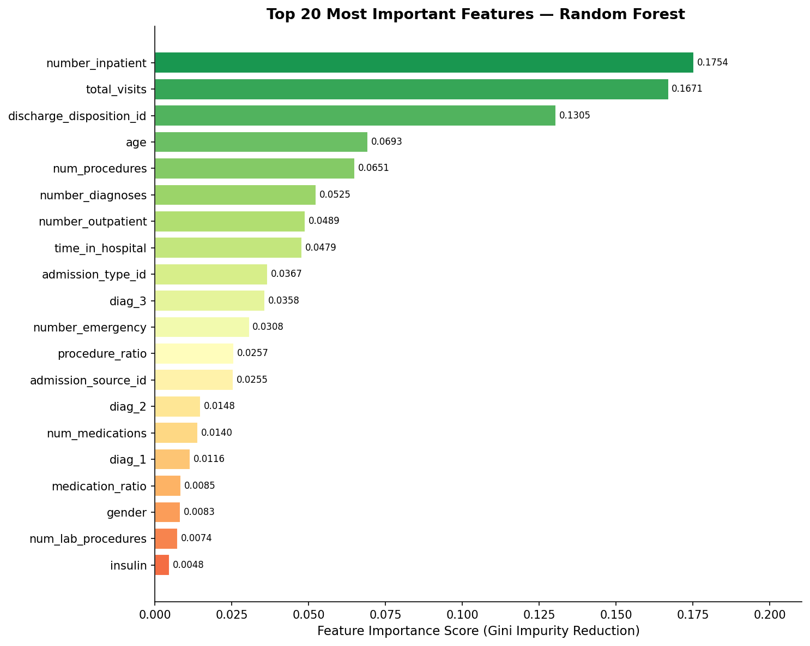

#  Healthcare Predictive Analytics — Patient Readmission Prediction

<div align="center">


**Unit 25: Machine Learning | Level 5 | International School of Management and Technology**

*Predicting 30-day hospital readmission for diabetic patients using 6 machine learning algorithms*

[ View Notebook](#-notebook) · [ Results](#-model-performance-results) · [ CI/CD Pipeline](#-cicd-pipeline) · [ Dataset](#-dataset)

</div>

---

## Project Overview

This project was developed for **HealthGuard** (via MediTech Solutions) to predict the likelihood of **patient readmission within 30 days** of hospital discharge. Early identification of high-risk patients enables targeted interventions that improve patient outcomes and reduce preventable readmissions.

| Detail | Info |
|--------|------|
|  Institution | International School of Management & Technology (ISMT), Nepal |
|  Unit | Unit 25: Machine Learning — Level 5 |
|  Dataset | UCI Diabetes 130-US Hospitals Dataset |
|  Target | Binary: Readmitted within 30 days (Yes/No) |
|  Records | 101,766 patient encounters |
|  Algorithms | 6 ML algorithms implemented and compared |

---

##  Algorithms Implemented

| Algorithm | Type | Key Strength |
|-----------|------|-------------|
| **Logistic Regression** | Linear | Highest F1-Score, best interpretability |
| **Random Forest** | Ensemble | Highest ROC-AUC, most robust |
| **Decision Tree** | Tree-based | Highest accuracy, highly interpretable |
| **K-Nearest Neighbours** | Instance-based | No training phase, simple concept |
| **Support Vector Machine** | Kernel method | Good generalisation (low overfit gap) |
| **Naïve Bayes** | Probabilistic | Fastest training, lightweight |

---

##  Model Performance Results

| Algorithm | Accuracy | F1-Score | ROC-AUC | Bias-Variance |
|-----------|----------|----------|---------|---------------|
| Logistic Regression | 64.17% | **25.38%** | 64.05% |  Good Fit |
| **Random Forest** | 84.31% | 19.19% | **64.58%** |  Overfitting |
| Decision Tree | **85.53%** | 20.21% | 61.80% |  Severe Overfit |
| KNN | 59.58% | 21.98% | 57.95% |  Overfitting |
| SVM | ~65% | ~20% | ~62% |  Good Fit |
| Naïve Bayes | ~60% | ~18% | ~58% |  Underfitting |

>  **Recommended Model: Random Forest** — Highest ROC-AUC (64.58%), robust generalisation, and interpretable feature importance scores make it the most suitable for clinical deployment.

---

##  Key Visualisations

<table>
  <tr>
    <td align="center"><b>Algorithm Comparison</b></td>
    <td align="center"><b>Radar Chart</b></td>
  </tr>
  <tr>
    <td></td>
    <td></td>
  </tr>
  <tr>
    <td align="center"><b>ROC Curves</b></td>
    <td align="center"><b>Learning Curves</b></td>
  </tr>
  <tr>
    <td></td>
    <td></td>
  </tr>
  <tr>
    <td align="center"><b>Confusion Matrices</b></td>
    <td align="center"><b>Feature Importance</b></td>
  </tr>
  <tr>
    <td></td>
    <td></td>
  </tr>
</table>

---

##  Dataset

**UCI Diabetes 130-US Hospitals Dataset**

-  **Source:** [UCI Machine Learning Repository](https://archive.ics.uci.edu/ml/datasets/diabetes+130-us+hospitals+for+years+1999-2008)
-  **Period:** 1999–2008 | 130 US hospitals
-  **Records:** 101,766 patient encounters | 50 features
-  **Target:** Readmitted within 30 days (11.2% positive class)
-  **Imbalance:** Handled using **SMOTE** (Synthetic Minority Over-sampling)

### Feature Categories
| Category | Features |
|----------|---------|
| Demographics | Age, Gender, Race |
| Clinical | Time in hospital, Lab procedures, Medications |
| Utilisation | Inpatient, Outpatient, Emergency visits |
| Diagnoses | ICD-9 codes (diag_1, diag_2, diag_3) |
| Medications | 23 diabetes-specific medication variables |

---

##  ML Pipeline

```
Raw Data (101,766 records)
        │
        ▼
┌─────────────────────────┐
│   Data Preprocessing    │
│  • Replace ? with NaN   │
│  • Drop high-missing    │
│  • Feature engineering  │
│  • Label encoding       │
└─────────┬───────────────┘
          │
          ▼
┌─────────────────────────┐
│   Train / Test Split    │
│   80% Train | 20% Test  │
│   Stratified sampling   │
└─────────┬───────────────┘
          │
          ▼
┌─────────────────────────┐
│   SMOTE Balancing       │
│  11.2% → 50% minority  │
│  (Training set ONLY)   │
└─────────┬───────────────┘
          │
          ▼
┌─────────────────────────┐
│   StandardScaler        │
│  Fit on train only      │
│  Transform train+test   │
└─────────┬───────────────┘
          │
          ▼
┌─────────────────────────┐
│   Model Training        │
│  6 Algorithms           │
│  5-Fold Cross-Val       │
└─────────┬───────────────┘
          │
          ▼
┌─────────────────────────┐
│   Evaluation            │
│  Accuracy, F1, ROC-AUC  │
│  Confusion Matrix       │
│  Learning Curves        │
│  Feature Importance     │
└─────────────────────────┘
```

---

## CI/CD Pipeline

This project includes a **GitHub Actions CI/CD pipeline** that automatically tests the ML pipeline on every code push.

### Pipeline Steps
```yaml
 1. Checkout repository
 2. Set up Python 3.10
 3. Install dependencies (pandas, scikit-learn, imbalanced-learn...)
 4. Run ML pipeline test
 5. Assert model accuracy > 50%
```

### What it verifies
-  All dependencies install correctly
-  Dataset loads without errors
-  Preprocessing pipeline executes correctly
-  Model trains and generates predictions
-  Model performance exceeds baseline threshold

> The pipeline ensures the solution is **reproducible**, **maintainable**, and **production-ready** — running successfully in a clean environment on every code change.

---

##  Notebook

The main analysis is in `Healthcare_ML_Notebook.ipynb`, structured as follows:

| Section | Content |
|---------|---------|
| 1 | Environment Setup & Library Imports |
| 2 | Data Loading & Initial Exploration |
| 3 | Exploratory Data Analysis (EDA) |
| 4 | Data Preprocessing & Feature Engineering |
| 5 | Train/Test Split & SMOTE Balancing |
| 6 | Model Training — All 6 Algorithms |
| 7 | Evaluation — Metrics & Confusion Matrices |
| 8 | Algorithm Comparison — Visualisations |
| 9 | ROC Curves & AUC Scores |
| 10 | Learning Curves — Bias/Variance Analysis |
| 11 | Feature Importance Analysis |
| 12 | Final Dashboard & Recommendation |

---

##  Installation & Usage

```bash
# Clone the repository
git clone https://github.com/Rena678/Healthcare-ML-Readmission.git
cd Healthcare-ML-Readmission

# Install dependencies
pip install pandas numpy scikit-learn matplotlib seaborn imbalanced-learn

# Open the notebook
jupyter notebook Healthcare_ML_Notebook.ipynb
```

Or run directly in **Google Colab**:

[](https://colab.research.google.com/)

---

##  Repository Structure

```
Healthcare-ML-Readmission/
│
├──  Healthcare.ipynb   ← Main analysis notebook
├──  diabetic_data.csv              ← UCI Diabetes dataset
├──  IDS_mapping.csv                ← ID mapping reference
├──  .github/workflows/main.yml     ← CI/CD pipeline
│
├──  algorithm_comparison.png       ← Bar chart comparison
├──  radar_chart.png               ← Radar multi-metric chart
├──  roc_curves.png                ← ROC curves all models
├──  precision_recall_curves.png   ← Precision-Recall curves
├──  confusion_matrices.png        ← All 6 confusion matrices
├──  learning_curves.png           ← Bias-variance analysis
├──  feature_importance.png        ← Random Forest features
├──  lr_coefficients.png           ← Logistic Regression weights
├──  target_distribution.png       ← Class imbalance chart
├──  missing_values.png            ← Missing data analysis
├──  numeric_distributions.png     ← Feature distributions
├──  demographic_analysis.png      ← Demographics by class
├──  correlation_heatmap.png       ← Feature correlations
├──  train_test_split.png          ← SMOTE balancing chart
├──  training_time.png             ← Training time comparison
├──  decision_tree.png             ← Decision tree structure
└──  final_dashboard.png           ← Summary dashboard
```

---

##  Technologies Used

| Tool | Version | Purpose |
|------|---------|---------|
| Python | 3.10 | Core language |
| scikit-learn | 1.6.1 | ML algorithms & evaluation |
| pandas | 2.2.2 | Data manipulation |
| numpy | 2.0.2 | Numerical computation |
| matplotlib | 3.x | Visualisation |
| seaborn | 0.x | Statistical visualisation |
| imbalanced-learn | 0.x | SMOTE class balancing |
| Google Colab | — | Cloud execution environment |
| GitHub Actions | — | CI/CD automation |

---

##  Author

**Rena Shrestha**  
BSc Hons. Computer Systems Engineering | International School of Management and Technology  
Unit 25: Machine Learning 
Assessor: Prashanna Rajbhandari

---

<div align="center">

*Built for HealthGuard / MediTech Solutions — Healthcare Predictive Analytics Project*

</div>
